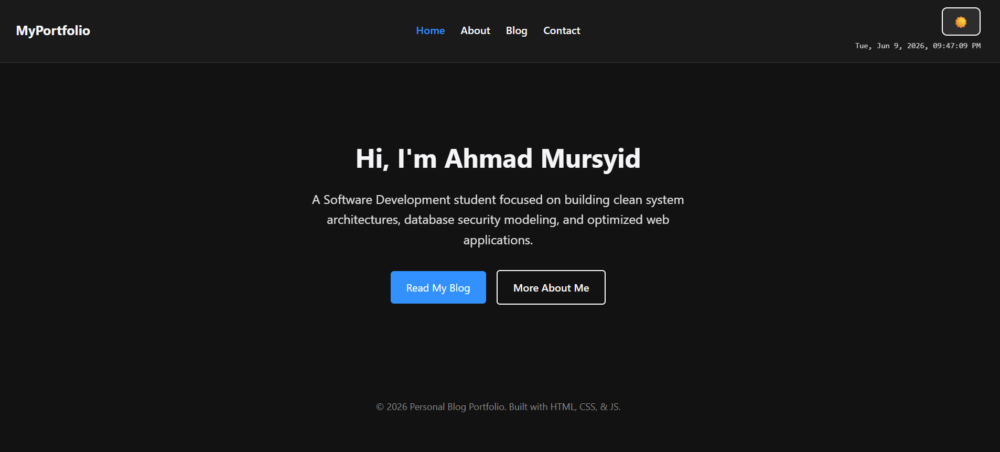

# Personal Blog Portfolio Website 🚀

Welcome to the source code repository for my personal developer portfolio and blog website. This project is built as a fully responsive, clean, and modern web application to showcase my academic journey, system architecture designs, and core software development projects.

## 📸 Live Preview



*Live Site URL:* [https://mursyid-19.github.io/personal-blog-portfolio/](https://mursyid-19.github.io/personal-blog-portfolio/)

---

## 🛠️ Tech Stack & Features

- **Semantic HTML5:** Structured layout using clean, accessible sections (`<header>`, `<main>`, `<footer>`, `<article>`).
- **Custom CSS3 Architecture:** Built entirely with native CSS variables (`--bg-color`, `--text-color`, `--accent-color`) for streamlined styling components and global transitions.
- **Dynamic Dark/Light Toggle:** JavaScript-powered theme switching backed by browser `localStorage` memory synchronization.
- **Header Control Live Clock:** An efficient, interval-based JavaScript system clock updating numbers seamlessly every second directly beneath the theme switch.
- **Automated Deployment:** Integrated pipeline utilizing **GitHub Pages** for instant background continuous deployment builds.

---

## 📂 Project Architecture

The repository maintains an organized, modular static file layout:

```text
personal-blog-portfolio/
│
├── assets/                  # Images, university logos, and site previews
│   ├── portfolio-preview.png
│   └── unisza-logo.png
│
├── css/                     # Universal stylesheets
│   └── styles.css
│
├── js/                      # Core scripting execution engines
│   └── script.js
│
├── index.html               # Landing profile homepage
├── about.html               # Technical skills, academic track, and features
├── blog.html                # Project showcases (USMS, BookSaw)
└── contact.html             # Secure SVG-embedded reach out channel
